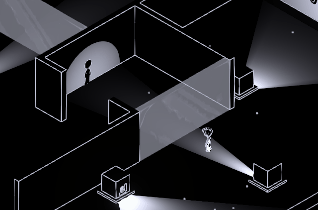
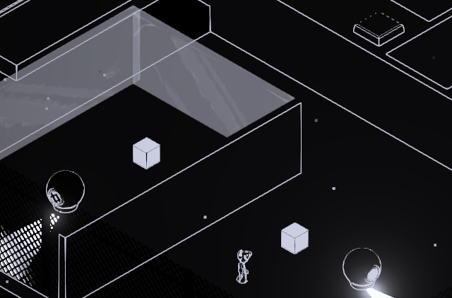

# 🔦 Chasm

Chasm is a **puzzle adventure** set in the dream, or should I say the nightmare of Camille, a small and traumatized child. Naviguate **a maze of light and shadows** using them to **teleport and reshape walls** to your wishes!  

**Role:** _Game Designer / Puzzle & Level Designer_  
**Team size:** _10 people_  
**Duration:** _4.5 months_  
**Tools:** _Unity 6_  
**Links:** [GitHub](#) · [Play it](#) · [Trailer](#videos)

## Overview

Chasm is a school project made during my second year at Rubika. For the second part of that year we got to [study in Montréal](../experiences/Montreal_Study_Semester.md). This is during that period that this project took place. 
We got together with a team of 10 people: 4 Designers / 4 Artists / 2 Tech-Artists. Each one of those fields picked a random theme to help us build our core fantasy:

- Design: Play of light (_Jeux de lumière_) 
- Art: Shadow Puppetry (_Théâtre d'ombre_) 
- Tech-Art: Dynamic topology (_Topologie dynamique_)

From those themes we decided to build a game around 2 major mechanics:

<figure markdown>
  { width="400" }
  <figcaption>Core Mechanic 1 — Shadow Teleport</figcaption>
</figure>

<figure markdown>
  { width="400" }
  <figcaption>Core Mechanic 2 — Anti-matter Cube</figcaption>
</figure>

We really wanted our players to **think outside the box**, and be able to **shape their own path** through the levels. For this we designed levels that feel like **sealed boxes**, with literally **no way to escape**, traps in a way. Then we gave our players the ability to **phase through transparent surfaces or even reshape walls through the help of shadows** so they would be able to carve through the levels until they reached the exit.

We worked on this game for about **four and a half months**, while still studying at Rubika Montréal. With this time we were able to create **9 levels, divided in 3 worlds** representing the three traumas of Camille.
We're especially proud of **how much we got to polish this game** and we would definitely enjoy working again on this project given the opportunity!  

*You can find a mention of every person that worked in the team in the [trailer](#screenshots-video). I want to add a special thanks to Pierre Delage and the education team at Rubika Montréal for their help throughout this production!*

## My Contribution

For Chasm I mostly worked as **Game Designer**. This project took place during a period where I was uncertain about which path to follow for the rest of my studies. At Rubika, for the third year, we're given the choice to remain in Game Design classes or change to Programming. I worked as an almost full time programmer for two of the three previous projects so I decided to **see what I was capable of as a designer** to help me make a choice. 

As a group, **we landed very quickly on what would be our chore mechanic and our design philosophy**. This means that I had to work mostly on level design.  I designed about **half of every level modules or room segments**, then worked on **the overall homogeneity between the levels**, helping to build a **progressive difficulty** accross levels.

Seeing how fast we were able to assemble these levels **I ended up helping my colleagues in other fields** to make sure we could polish the game as much as possible, while the rest of the designer team focused on tweaking the levels based on playtests. During this phase I got to work a bit on the **programming**, notably to **build menus, credits or patch some glitches**. I also worked with the art team to **animate all the background elements** directly in engine.

<figure markdown>
  { width="400" }
  <figcaption>Main Menu</figcaption>
</figure>

<figure markdown>
  { width="400" }
  <figcaption>Some in-engine animations</figcaption>
</figure>

## Videos

<figure>
  <iframe
    width="560"
    height="315"
    src="https://www.youtube.com/embed/3kWtYY4hEWE"
    title="YouTube video player"
    frameborder="1"
    allow="accelerometer; autoplay; clipboard-write; encrypted-media; gyroscope; picture-in-picture; web-share"
    referrerpolicy="strict-origin-when-cross-origin"
    allowfullscreen>
  </iframe>

  <figcaption>
    <em>Release Trailer for <strong>Chasm</strong>.</em>
  </figcaption>
</figure>

<figure>
  <iframe
    width="560"
    height="315"
    src="https://www.youtube.com/embed/nwFK70MHryg"
    title="YouTube video player"
    frameborder="1"
    allow="accelerometer; autoplay; clipboard-write; encrypted-media; gyroscope; picture-in-picture; web-share"
    referrerpolicy="strict-origin-when-cross-origin"
    allowfullscreen>
  </iframe>

  <figcaption>
    <em>Gameplay clip of level 3-1 in <strong>Chasm</strong>.</em>
  </figcaption>
</figure>

## Challenges & what I learned

My biggest challenge for this projet was **learning how to juggle between different tasks**. This was really an important challenge for me because I feel like it **brought me closer to my goal of becoming a Technical designer**. 
Being able to switch from coding to making levels, while also having to animate really helped me **get a grasp of every difficulties a Technical designer might face** during a production. It's also what allowed me to make a choice for the rest of my studies. Entering 3rd year I had to make a choice between continuing in the Game Design field or transition to the Programming classes. I realized during the production of Chasm that I mostly enjoyed **being able to work as a bridge between people**. My work has a lot of meaning for me if I can help others work together better. This is why **I ended up choosing to transition to the programming class**. I wanted to have **a more diverse array of skills**, more than I wanted to refine those I already developped during the two years I did as a Game Designer.

  1 · 
  [2](Full_Plastic_Shooter.md) · 
  [3](SNCF_SeriousGame.md) · 
  [4](Spiritfarer_Randomizer_Mod.md)

