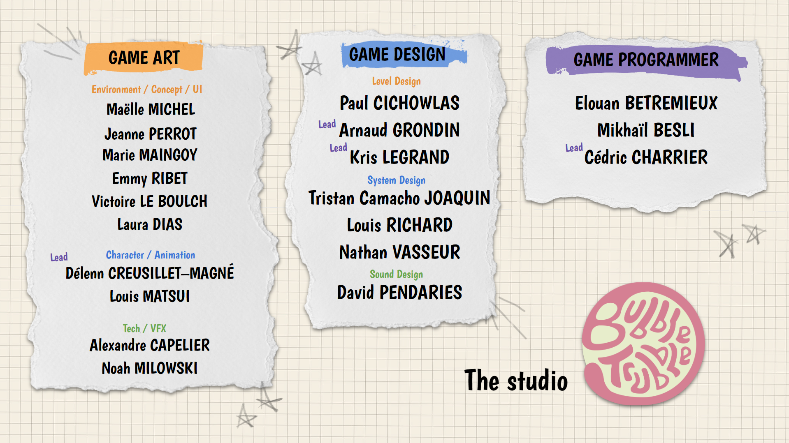

# 🔫 Full Plastic Shooter

One-line pitch — what the game/project is, in a single punchy sentence.

**Role:** _Lead Game Programmer_  
**Team size:** _20 people_  
**Duration:** _4 months_  
**Tools:** _Unity 6.3_  
**Links:** [GitHub](#) · [Play it](#) · [Trailer](#videos)

## Overview

xx

<figure markdown>
  { width="600" }
  <figcaption>Full Plastic Shooter Credits</figcaption>
</figure>

## My contribution

xx

## Videos

<figure>
  <iframe
    width="560"
    height="315"
    src="https://www.youtube.com/embed/O546-GLrDcc"
    title="YouTube video player"
    frameborder="1"
    allow="accelerometer; autoplay; clipboard-write; encrypted-media; gyroscope; picture-in-picture; web-share"
    referrerpolicy="strict-origin-when-cross-origin"
    allowfullscreen>
  </iframe>

  <figcaption>
    <em>Release Trailer for <strong>Full Plastic Shooter</strong>.</em>
  </figcaption>
</figure>

<figure>
  <iframe
    width="560"
    height="315"
    src="https://www.youtube.com/embed/Grs-mBlUGxk"
    title="YouTube video player"
    frameborder="1"
    allow="accelerometer; autoplay; clipboard-write; encrypted-media; gyroscope; picture-in-picture; web-share"
    referrerpolicy="strict-origin-when-cross-origin"
    allowfullscreen>
  </iframe>

  <figcaption>
    <em>Gameplay clip from <strong>Full Plastic Shooter</strong>.</em>
  </figcaption>
</figure>

## Challenges & what I learned

xx

  [1](Ijiraaq.md) · 
  [2](Chasm.md) · 
  3 · 
  [4](SNCF_SeriousGame.md) · 
  [5](Spiritfarer_Randomizer_Mod.md)

