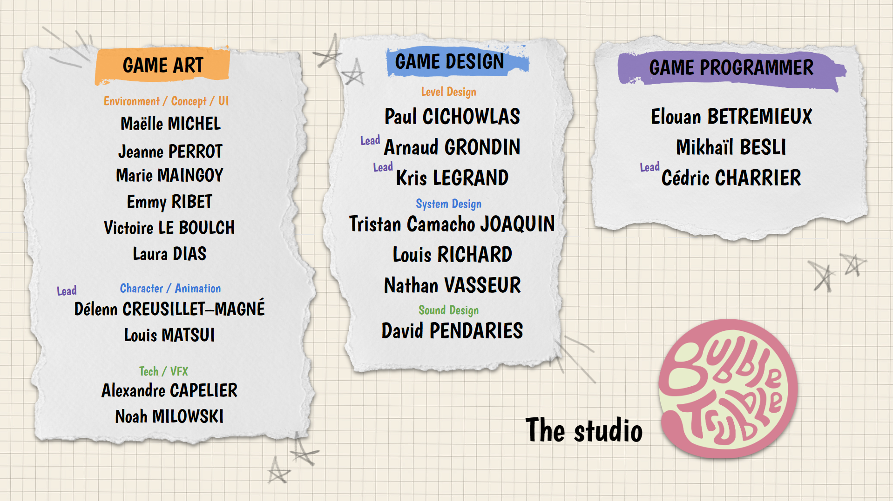
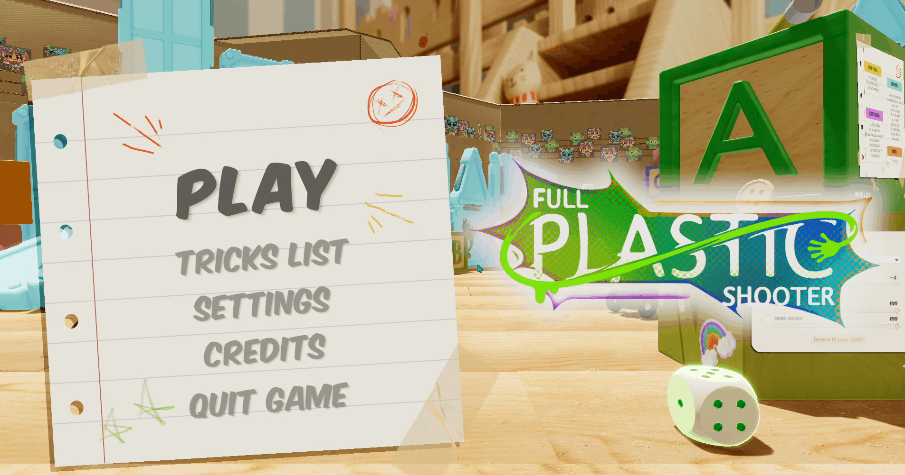

# 🔫 Full Plastic Shooter

Full Plastic Shooter is a **Fast FPS** in which you play as the Gladiatoy, an old action figure fighting for his right to go on vacations with his owner. Use your **made up sticky arm** to **steal the weapons of you enemies** and tear accross everything in your path.

**Role:** _Lead Game Programmer_  
**Skills:** _Project & Team Management / Tools & Systems Design_ 
**Team size:** _20 people_  
**Duration:** _4 months_  
**Tools:** _Unity 6.3_  
**Links:** [GitHub](https://github.com/Kylobsii/FFPS_SoloClassique){:target="_blank"} · [Play it](No_Play_Link.md) · [Trailer](#videos)

## Overview

Full Plastic Shooter was my **second project as a programming student**. For the first time at Rubika we got to work with **a big team of 20 people**: 3 Programmers / 7 Designers / 10 Artists. Our only guideline was to build a **Classical Solo Fast-FPS**, a Doom-like in a way.

We didn't want players to rely on a prefered weapon so **we didn't gave them any weapons**, but a **grab mechanic** instead that lets them **steal their enemies' gun**. We reinforced this stealing mechanic by making **"one-use"** weapons with very few ammos and no way to reload.  
During playtests we realized that **players wanted to throws things too**, so we implemented the throw mechanic into the loop by asking players to **stun enemies before stealing their weapons**. 

<figure markdown>
  { width="600" }
  <figcaption>Grab & Throw Mechanics</figcaption>
</figure>

<figure markdown>
  { width="600" }
  <figcaption>Stun & Steal Mechanics</figcaption>
</figure>

To create some variety we added **four different weapons** with major differences in their design philosophy. **Each of these were given an alt-fire** when holding down the shooting button:

- The <u>**Bubble Gun**</u> is the main weapon, the first one the player is given. It works like a revolver but has a more shotgun like shot when the weapon is charged.
- The <u>**"Critérium"**</u> (Mechanical pencil) work as a fast sniper gun with a normal shot upon clicking, but a more powerful and zoomed-in one when held.
- The <u>**Elastic Shooter**</u> is a classical machine gun, it has the most rapid firing rate out of all when the button is held down.
- The <u>**Chupa Shoot**</u> is a rocket launcher where fired rockets are redirected towards the crosshair when holding down the fire button.

<figure markdown>
  { width="600" }
  <figcaption>Bubble Gun</figcaption>
</figure>

<figure markdown>
  { width="600" }
  <figcaption>Critérium</figcaption>
</figure>

<figure markdown>
  { width="600" }
  <figcaption>Elastic Shooter</figcaption>
</figure>

<figure markdown>
  { width="600" }
  <figcaption>Chupa Shoot</figcaption>
</figure>

The last core mechanic we added was a **Hype meter**, increased by **more than 20 different tricks** the player can pull of, like a headshot, a mid-air grab or evengrabbing an entire enemy to use as a projectile!

<figure markdown>
  { width="200" }
  <figcaption>Hype Meter</figcaption>
</figure>

The **main focus of this project**, school-wise, **was to have leads** in the different fields **to manage teams** and tasks, **facilitate communications** between people, as well as **to take the role of vision owners**. This was a new way for us to work, this allowed us to **have a more structured production** that was more aligned with the size of the teams.

<figure markdown>
  { width="600" }
  <figcaption>Full Plastic Shooter Credits</figcaption>
</figure>

## My contribution

I was the **lead programmer** for Full Plastic Shooter. I had to: 

- **Manage the programming team**
- **Maintain the link between our team and the designers and artists**. 

I put in place **a roadmap with detailed tasks**, with hours estimations. This allowed us to **dispatch the work flawlessly accross all three of us**. By following the previsions I made **we were able to wrap up the main programming work with about three weeks left**. We used that time to **polish the game as much as possible**, even adding some **new features that we didn't plan at first** like an almanach of all the tricks the player can do in the game, or a full fletched tutorial with a special enemy instead of just plain text.

<figure markdown>
  { width="450" }
  <figcaption>Example of a bonus feature: List of tricks</figcaption>
</figure>

In terms of in game-implementations I worked on several things:

- <u>**Tooling**</u>: To make the bug fixing process easier I added a bug report tool in game with a screenshot mode and a quick .zip export
- <u>**Project Structure**</u>: I implemented the event bus system we use to dispatch informations across all scripts
- <u>**Weapons**</u>: I coded all the weapons and all their behaviours (picking up / throwing / main and alt fire...). More details in the [challenges](#challenges) section!
- <u>**UI & menus**</u>: Using my skills in in-engine animations I created flowing menus and highly responsive UI. 

The weapons system works with a custom strategy pattern that uses scriptable object.

## Videos

<figure>
  <iframe
    width="560"
    height="315"
    src="https://www.youtube.com/embed/O546-GLrDcc"
    title="YouTube video player"
    frameborder="1"
    allow="accelerometer; autoplay; clipboard-write; encrypted-media; gyroscope; picture-in-picture; web-share"
    referrerpolicy="strict-origin-when-cross-origin"
    allowfullscreen>
  </iframe>

  <figcaption>
    <em>Release Trailer for <strong>Full Plastic Shooter</strong>.</em>
  </figcaption>
</figure>

<figure>
  <iframe
    width="560"
    height="315"
    src="https://www.youtube.com/embed/Grs-mBlUGxk"
    title="YouTube video player"
    frameborder="1"
    allow="accelerometer; autoplay; clipboard-write; encrypted-media; gyroscope; picture-in-picture; web-share"
    referrerpolicy="strict-origin-when-cross-origin"
    allowfullscreen>
  </iframe>

  <figcaption>
    <em>Gameplay clip from <strong>Full Plastic Shooter</strong>.</em>
  </figcaption>
</figure>

## Challenges & what I learned

The main challenge I faced during the production was **how to flawlessly change the weapons** for players. In levels they are **expected to use between 10 to 40 weapons** depending on the length. My solution was to create **a custom strategy pattern that uses scriptable objects** so the player's weapon would **never leave his hand**, just change its behaviour and visual. To simplify, there are **two versions of each weapons**, the one held, and the one on the ground. The last one **acts as a key** (scriptable object), **to change the behaviour** of the held one (strategy pattern) into the corresponding weapon. 
  Feel free to take a look at the [code behind this system](https://github.com/Kylobsii/FFPS_SoloClassique/tree/main/Assets/04_GYMs/Game%20Prog/GYM_Cedric/00_Scripts/ShootingSystem){:target="_blank"}!

The other challenges I faced during this project **were linked to my role as a Lead programmer**. I had to **update the roadmap weekly** to take into account the **delays** and the **coding abilities of my team**. One key adjustment I made was reassigning enemy programming after the developer in charge was pulled into tech art, where his skills were needed more urgently. 

  1 · 
  [2](Chasm.md) · 
  [3](Ijiraaq.md) · 
  [4](SNCF_SeriousGame.md) · 
  [5](Spiritfarer_Randomizer_Mod.md)

