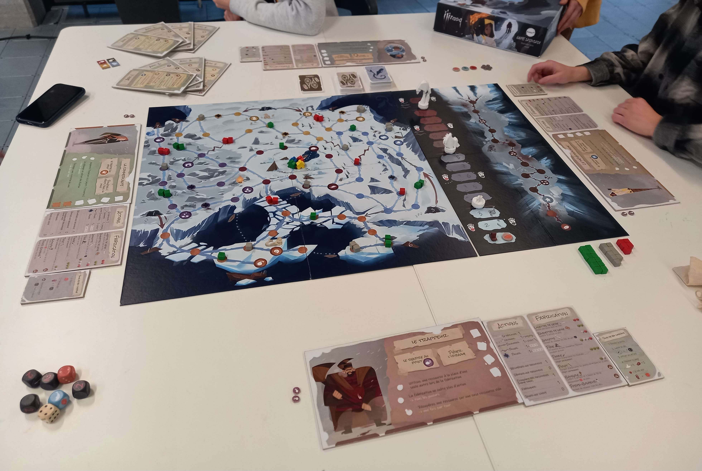
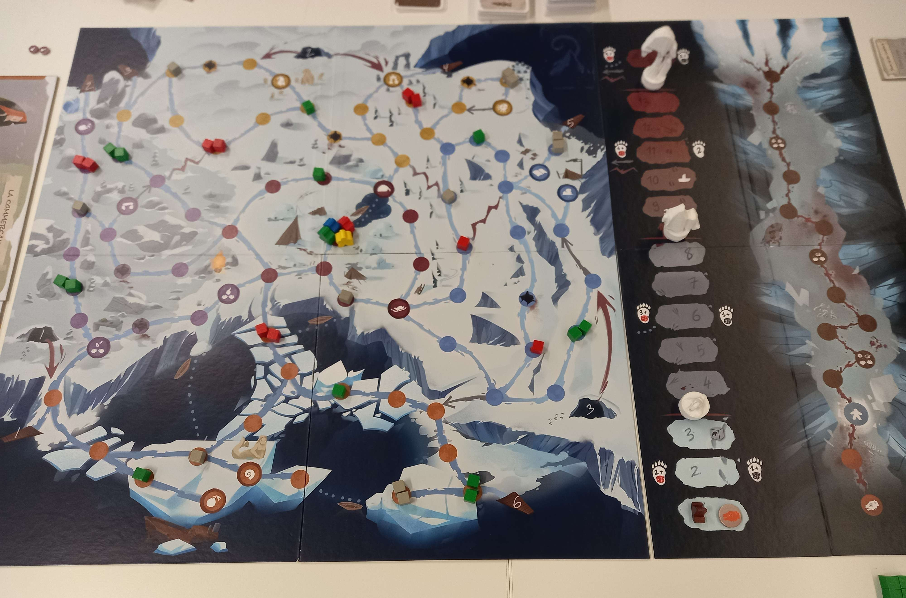
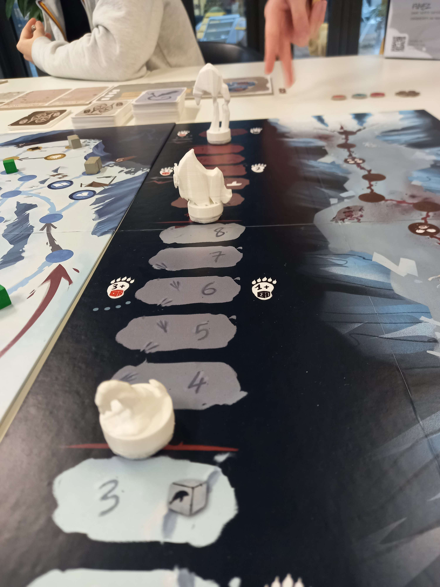
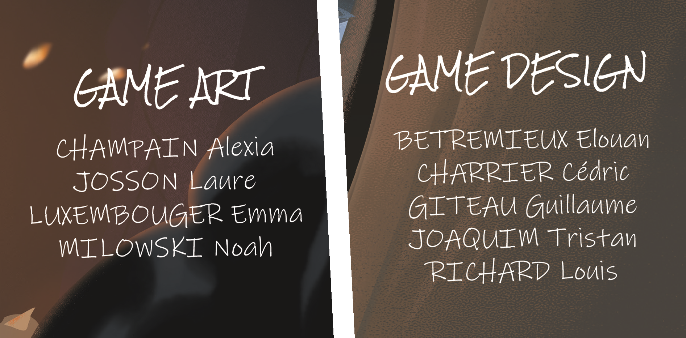

# 🧊 Ijiraaq

Ijiraaq is **a survival board game set in the icy winds of Nunavut**, an Inuit region in northern Canada. Gather **with three other players** and **cooperate, craft, and trade resources** to survive the Ijiraaq — a powerful beast **lurking beneath the ice**. But be careful as this powerful monster **can adapt**, reshaping itself to better track you accross the icefield!

Fall through the ice, and **you'll find yourself in its lair**, where **a tense chase begins** between you and the beast. **Work together** to make it out... **or betray your friends** if that's what survival takes.

**Role:** _Game Designer_  

**Team size:** _9 people_  
**Skills:** _Game Design / Team work / Rulebook Design_
**Duration:** _4.5 months_  
**Tools:** _Good ol' paper!_  
**Links:** [Play it on Table Top Sim.](https://steamcommunity.com/sharedfiles/filedetails/?id=3173130652)

## Overview

Ijiraaq is the **first game I ever got to work on** as a designer. I worked with a team of nine people : 4 artists and 5 designers. Our only direction was to make **a slasher boardgame**. One thing we decided quickly was that **we wanted a mix of cooperative and competitive gameplay**. We wanted our players to create alliances, but to betray their friends under the pressure of a drooling beast right behind them.

To achieve this goal, we let our players:

- **Pickup ressources** accross the board
- **Craft items** from these ressources
- **Trade items and ressources** if they are close enough
- **Complete entire archs of quests** as a team of two to get great rewards

If all those mechanics only seems like ways to help each other, they are **often the origin of a great betrayal**, like leaving a mission half completed, not respecting the trade promises, and much more. 

The game is **balanced in a way to make a solo survival impossible** and that **will probably won't spare every members of the expedition**. The **slasher is the most powerful entity** on the board, and **every survival options comes with a cost**. This is notably the case for being able to control the beast actions!

Players can indeed **drag the beast out of the main board** by intentionnaly **jumping in the monster's lair**. By doing that they trigger a chase on the second board. This is a **higly risky move** as it can result in the **immediate death of the player** if they aren't able to run fast enough, but it also comes with **great benefits**: It **can save another player** about to get eaten on the main board and it **allows the player to reappear on all corners of the map** if they make it out, making for a great fast travel method. 

Feel free to take a look at [the rulebook](../assets/pdf/IJIRAAQ_RuleBook.pdf){ target="_blank" } to find more details (only available in french).

<figure markdown>
  { width="600" }
</figure>

<figure markdown>
  { width="600" }
</figure>

<figure markdown>
  { width="225" }
  <figcaption>Final product printed with <u>Azao Games</u></figcaption>
</figure>

<figure markdown>
  { width="600" }
  <figcaption>Ijiraaq Credits</figcaption>
</figure>

## My contribution

I spent a lot of time trying to **balance the two boards**. This meant perfecting the **ressource distributions**, **path lenghts and dead-ends**, **quests locations**, and the **beast movement speed in its lair**. The final version of the board **allows player to work together** a lot while **spreading them around** the icefield. This design choice was really what permitted betrayals, because players would rarely be targetted by the beast at the same time.

I also worked on **the craft system** because items were **closely related to how the players would navigate the board**. For example I came up with slopes, one-way paths that could only be traversed the other way around with an ice axe. 

Finally I put together **the entire rule book** as well as the **little reminder cards summing up the important steps** to play a turn. This took a lot of time because **we didn't have a very common and beginner-friendly system**. I had to retake these almost as much as the boards during playtests because **players would consistently forget steps during their turn**.

## Videos

<figure>
  <iframe
    width="560"
    height="315"
    src="https://www.youtube.com/embed/NB1LWMhytq8"
    title="YouTube video player"
    frameborder="1"
    allow="accelerometer; autoplay; clipboard-write; encrypted-media; gyroscope; picture-in-picture; web-share"
    referrerpolicy="strict-origin-when-cross-origin"
    allowfullscreen>
  </iframe>

  <figcaption>
    <em>Showcase of the <u>tabletop simulator</u> version of <strong>Ijiraaq</strong>.</em>
  </figcaption>
</figure>

## Challenges & what I learned

As the boardgame was the first project we got to do at Rubika, the main challenge we all faced was **having to learn how to work together** as team of developpers, and **communicate efficently**. 

The other thing I got to learn was that **a complexe system is rarely the best solution**. Most of the time allocated to this project was spent **simplifying the systems** to : 

- Allow players to **better understand the game**
- **Facilitate the balancing process**
- **Reduce the duration of games**
- Create a **better synergy between systems** rather than an accumulation

  [1](Full_Plastic_Shooter.md) · 
  [2](Chasm.md) · 
  3 · 
  [4](SNCF_SeriousGame.md) · 
  [5](Spiritfarer_Randomizer_Mod.md)

