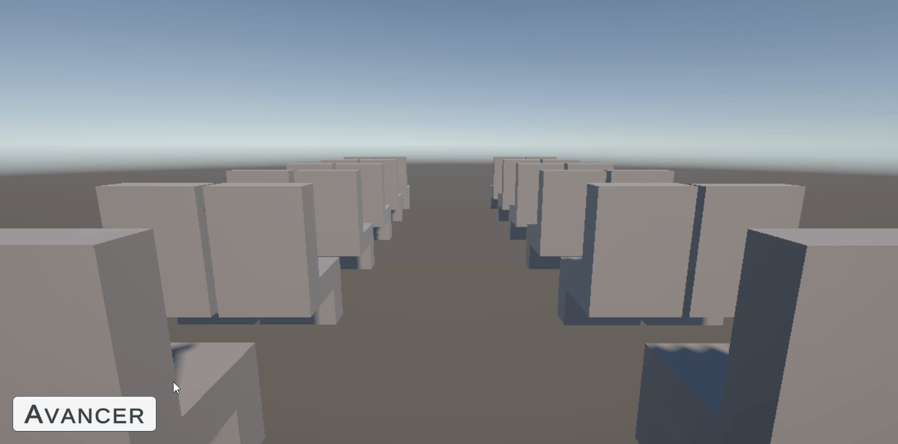
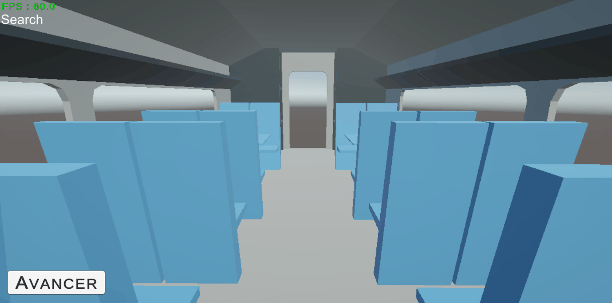
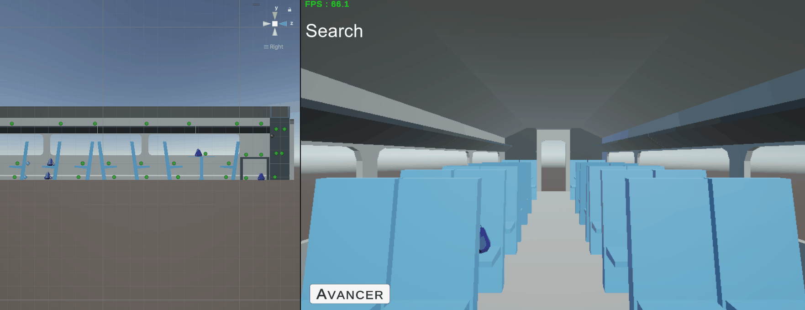

# 🚄 SNCF Serious Game

A serious game meant as a learning tool for SNCF's (France's train company) security agents and train conductors about how to handle lost & forgotten luggages. This game was developped on mobile.

**Role:** _Programmer_  
**Skills:** _Fast Prototyping / Client-Driven Development_  
**Team size:** _6 people_  
**Duration:** _2 weeks_  
**Tools:** _Unity 6.3_  
**Client:** SNCF  
**Links:** [GitHub](https://github.com/Kylobsii/DSIP_SNCF_Grp2){:target="_blank"} · [Play it](No_Play_Link.md)

## Overview

Third and fourth year students at Rubika are given a **two week client driven project**. For the third year I decided to **work with the SNCF** because they were looking for **serious game**, a type of project I was curious to discover. I got to work with a team of 6 persons : me as the programmer / 2 Designers / 3 artists.  

The directions that were given to us were simple:

- The game should be **playable over and over again**
- The game **must note learners mistakes** and **add explanations** on how to correct them
- The game should be **very clear with the consequences of a failure** (Bomb explosion? / Casualties?)
- The team must **deliver a demo** and not a finished product, but **any amount of polish is appreciated**  

To address these we made several decisions:

- Developping **a tool for mobile users**: The learners always have the game in their phone if needed.
- Making **a realistic representation of the situation**: The 1st person view, the variety of objects and outcomes, the probabilities of success and availabilities of the tools, etc.
- Adding **impactful sounds in the case of a failure**.
- Adding **a recap screen** both in case of failure and success, listing what was done correctly and what was not.  

Here's a short demonstration of what the game looked like after the two weeks:

<figure markdown>
  { width="600" }
  <figcaption>Demonstration of the tool by the end of the two weeks of developments</figcaption>
</figure>

## My Contribution

I was **the sole programmer** for this project. I implemented every aspect present in the final build, which includes:

- The **controller** for the character and the camera.
- The **Scriptable Object** script for designers to implement different objects (Dangerosity / Characteristics / Possible Placements ...).
- The **spawning of objects** (random places and objects).
- The **state pattern** that handles the different game phases (Looking for luggage / Inpsecting / Processing ...).
- The **UI behaviour** to process packages.
- The **mistake and correction system**.

Here are a set of gifs that will **to understand the evloution** of the demo during the two weeks: 

<figure markdown>
  { width="600" }
  <figcaption>1: Controller</figcaption>
</figure>

<figure markdown>
  { width="600" }
  <figcaption>2: Object View</figcaption>
</figure>

<figure markdown>
  { width="600" }
  <figcaption>3: State Machine + Start of UI</figcaption>
</figure>

<figure markdown>
  { width="600" }
  <figcaption>4: Random object placement</figcaption>
</figure>

## Challenges & what I learned

The main challenge was having to work with **clients that didn't know a lot about video game development**. The reason they wanted a serious game was **to lower the drop rate of SNCF's security agents learners**. We had to make a game that would **fit their definition of a learning tool**, while still making adjustments so that it **would land amongst players**. For the team this balance was especially hard to find, and for me this mostly meant having to do **fast prototyping** to show our clients our decisions **directly in the game**.

As the programmer I had to be able to **create a controller** that would not only **benefit the experience**, but also be **simple enough for non-gamers**. This is why the **camera uses a drag-to-pan** type of movement, instead of an orbit drag (generally considered to be harder to control for non-gamers), and why the **character movement is driven by a single button**!

  [1](Full_Plastic_Shooter.md) · 
  [2](Chasm.md) · 
  [3](Ijiraaq.md) · 
  4 · 
  [5](Spiritfarer_Randomizer_Mod.md)

